# Voting Machine Fraud in the State of Pennsylvania

This exposes the pattern between voter turnout and age caused by voting machine fraud in Pennsylvania in the 2020 General Presidential Election.

## Results

The following plots show how accurately actual votes cast can be predicted, given just the registered voters and overall turnout, for the 10 most populous counties in Pennsylvania.

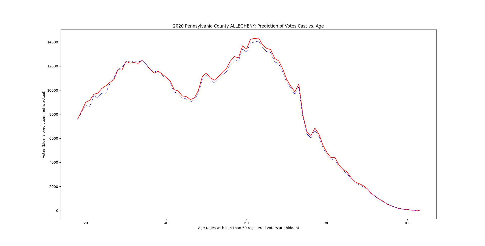
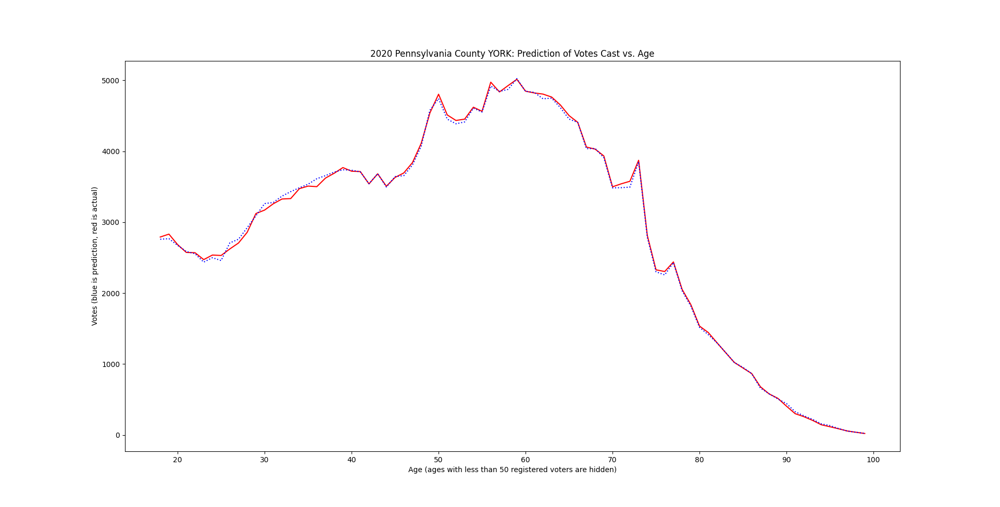
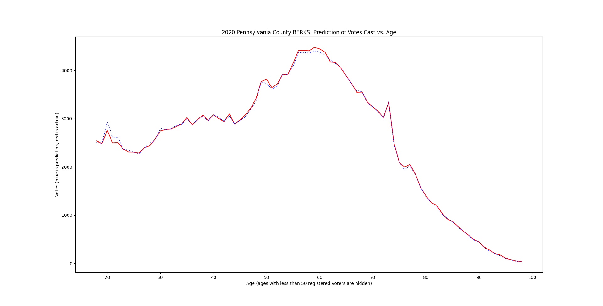
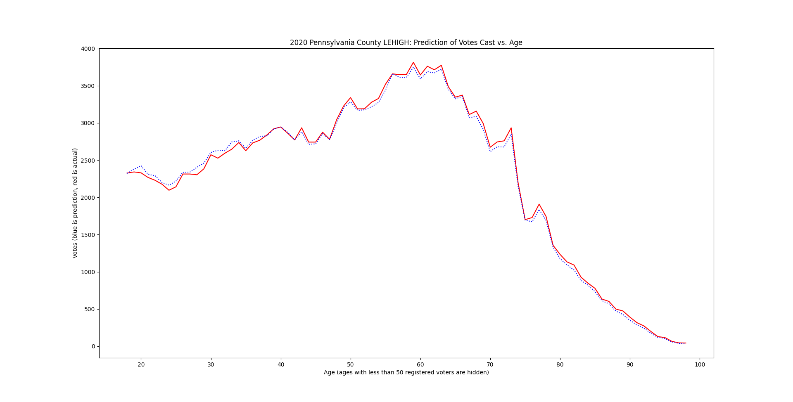
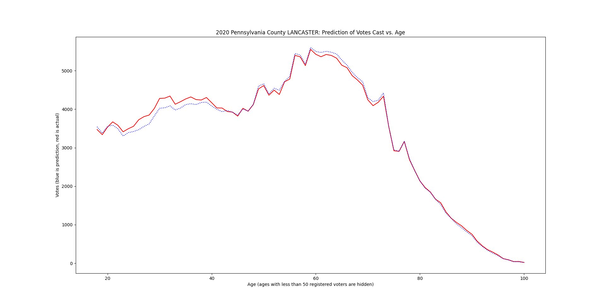

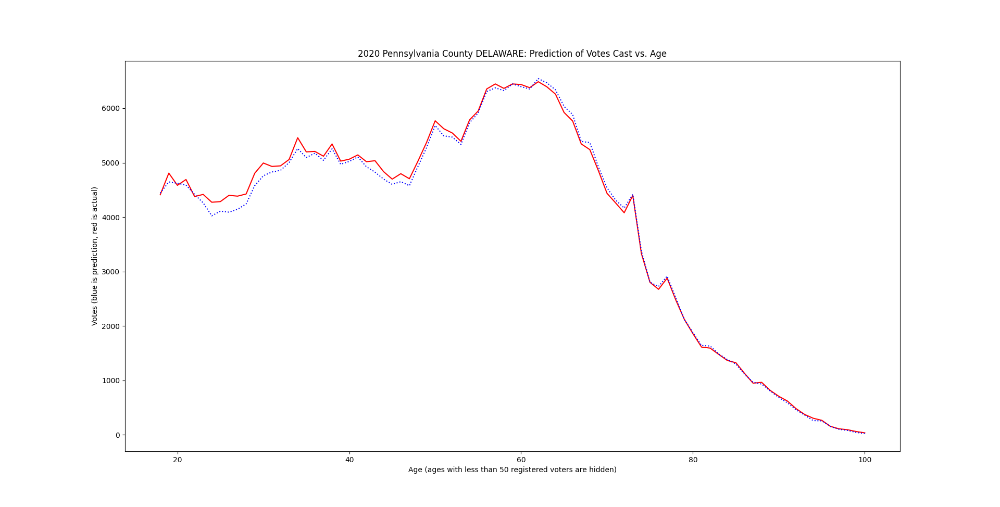
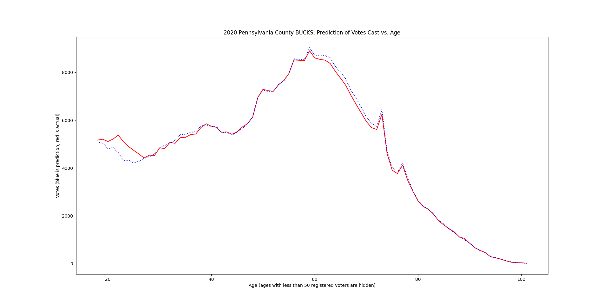
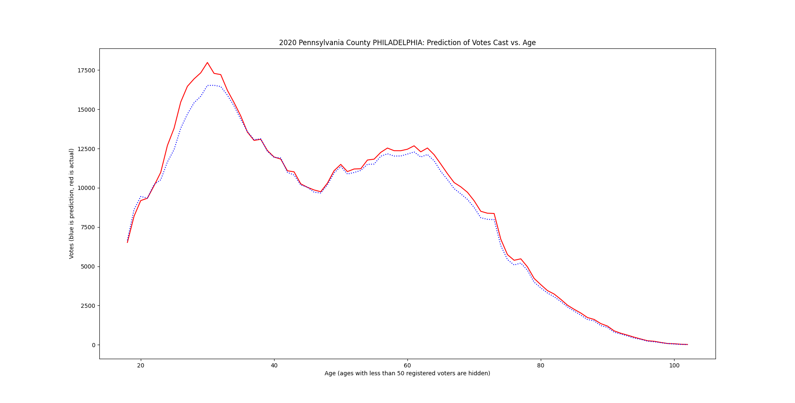
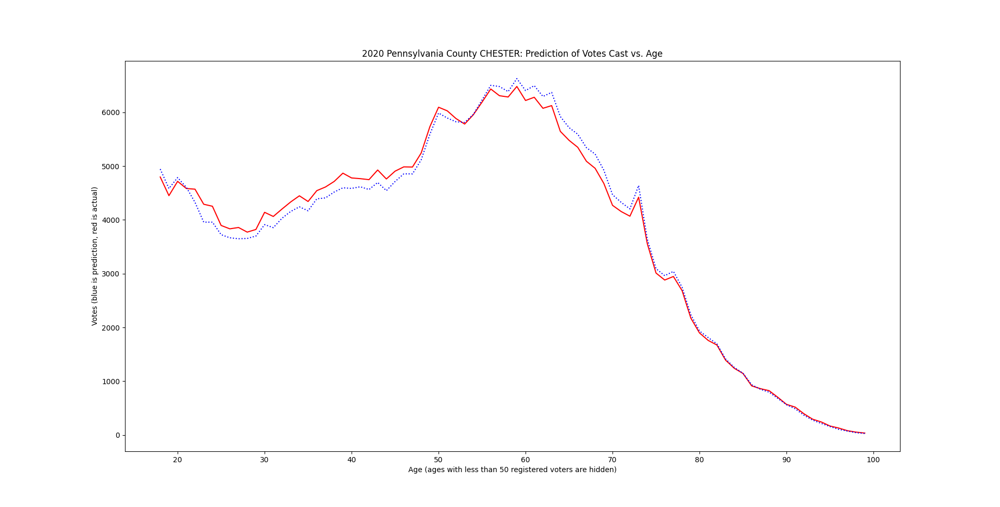
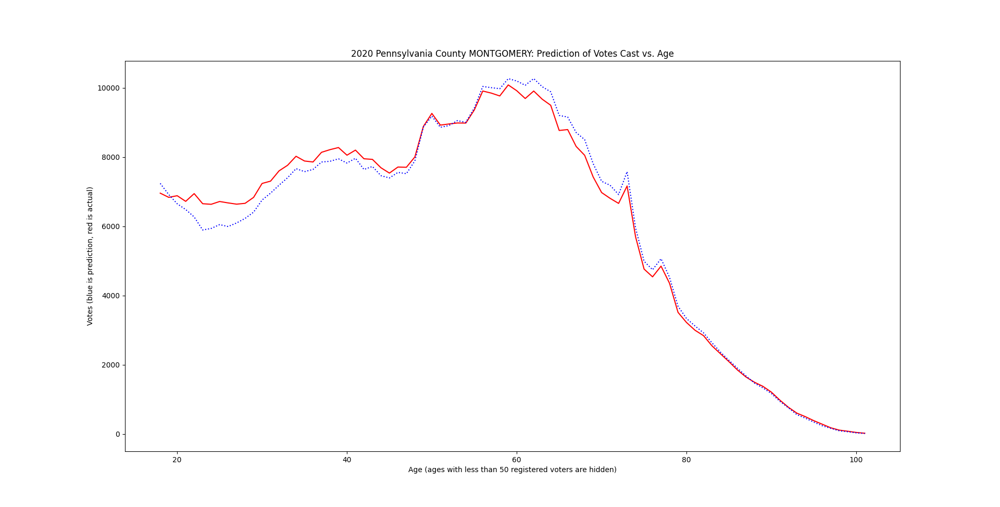

The following normalized turnout plots show how they converge to a common curve among all counties in the state. If you look at my other repositories, e.g. election-fraud-ohio, you will see that a similar convergence occurs, HOWEVER the exact curve is DIFFERENT, just by crossing state lines. This is not possible without fraud. All of the following normalized turnout plots use a 2020 voter roll.

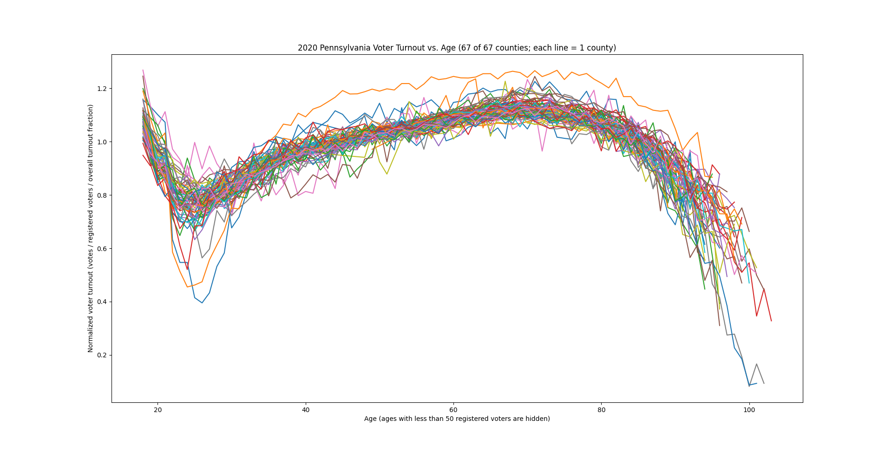

## Setup

Requires python3. Before running, be sure you have enough free space for the downloaded and decompressed CSV files, about 6.6 GB.

## Running

1. Download voter registration database (see 'Data Source' section).
2. Move and rename decompressed folder to `./data/Statewide`.
3. To plot voter turnout lines vs. age for all counties on the same plot: `./plot_turnout_by_age.py`.

## Data Source

Pennsylvania requires a $20.00 fee to download the voter registration database, and prohibits some forms of distribution.

Pennsylvania Full Voter Export (voter registration database): https://www.pavoterservices.pa.gov/Pages/PurchasePAFULLVoterExport.aspx

